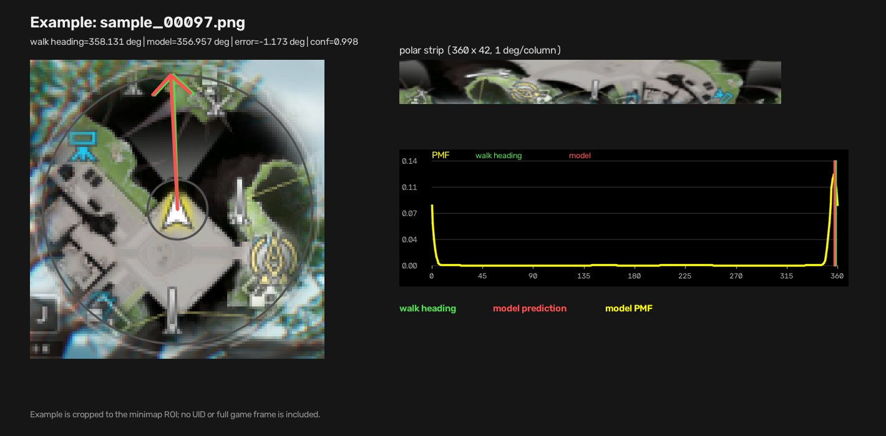

# PR #5627 小地图摄像机朝向模型测试报告

## 结论

在 335 张“直走末端”实机截图上，使用 PR #5627 的 `cameraorientation.onnx` 与 C++ 侧一致的预处理进行离线推理：

- 相对直走位移推导方向的 MAE：`1.3479 deg`
- RMSE：`1.7135 deg`
- 中位绝对误差：`1.1735 deg`
- P95 绝对误差：`3.0719 deg`
- 最大绝对误差：`6.9259 deg`
- `<= 5 deg`：`99.40%`
- `<= 10 deg`：`100.00%`
- 模型置信度均值：`0.9971`，最低：`0.9528`

这些样本支持“按 W 直走时，角色朝向约等于摄像机朝向”的采集假设。该结论是候选验证，不是直接测量摄像机朝向得到的真值。



示例：`sample_00097.png`。直走位移方向为 `358.1306 deg`，模型输出为 `356.9571 deg`，误差 `-1.1735 deg`，模型置信度 `0.9984`。图中只保留小地图 ROI、极坐标条带和 PMF 曲线，不包含 UID 或完整游戏画面。

## 数据来源

- 数据集：`D:/kang/maaend/test/map_direction_samples/20260905_185001`
- 样本数：`335`
- 图像：`1280x720` PNG，真实设备帧
- 标签：`labels.jsonl`
- 采集区域：`ValleyIV_Base`
- 移动距离：`8.6161..15.4093 px`
- 标签分布：覆盖 `0..360 deg` 全周；以 10 度分箱统计，各箱样本数为 `4..15`
- 生成脚本：`D:/kang/maaend/test/map_direction_sampler.py`

`map_direction_sampler.py` 在固定停止区附近随机转动镜头，随后按住 `W`，持续通过 `MapLocateRecognition` 获取角色全局坐标，直到角色离开停止区。终点截图保存后，用起点和终点的坐标差计算移动方向：

```text
dx = end.x - start.x
dy = end.y - start.y
heading_deg = atan2(dx, -dy) mod 360
```

因此这里的 `heading_deg` 是移动方向标签。将它作为摄像机朝向真值，依赖“直走时角色朝向已经对齐摄像机朝向”的前置条件。

## 测试方式

评估脚本：`evaluate.py`

使用 PR 模型文件：

```text
D:/kang/maaend/MaaEnd/assets/resource/model/map/cameraorientation.onnx
SHA256 e60fd0ef890f7985758f172a671bb47e3b0f93f6c08953c3b643959a646203fe
```

模型输入契约：

```text
name: strip
type: tensor(uint8)
shape: [1, 42, 360, 3]
layout: NHWC
color: BGR
```

预处理与 C++ 实现保持一致：

1. 以 720p 基准坐标 `(108, 111)` 为小地图中心。
2. 取内径 `12 px`、外径 `54 px` 的圆环。
3. 以正北为第 0 列、顺时针为正、每列 1 度进行极坐标展开。
4. 使用 `cv2.INTER_LINEAR` 和 `BORDER_REPLICATE` 采样。
5. 输出 `360x42 BGR uint8` 条带，保持 `0..255` 数值域；模型首层已折入 `/255`。

后处理与 PR 的 C++ 解码逻辑保持一致：

1. 对 360 个概率 bin 取 `argmax` 得到峰中心。
2. 在峰中心 `+/-5 deg` 圆形窗口内按 PMF 加权计算圆均值，得到亚度级角度。
3. 使用 360 个概率方向向量的合成模长与方向一致性计算置信度。

比较对象：

- 主指标：模型角度与 `heading_deg` 的圆周误差。
- 对照：`labels.jsonl` 中终点 `end_raw.rot` 与 `heading_deg` 的误差。
- 辅助：模型与终点 `end_raw.rot` 的直接差异。

## 结果

| 序列 | MAE | RMSE | 中位绝对误差 | P90 | P95 | <= 5 deg | <= 10 deg |
| --- | ---: | ---: | ---: | ---: | ---: | ---: | ---: |
| PR 模型 vs 直走方向 | 1.3479 | 1.7135 | 1.1735 | 2.6834 | 3.0719 | 99.40% | 100.00% |
| `end_raw.rot` vs 直走方向 | 1.2602 | 1.6969 | 0.9327 | 2.6013 | 3.1396 | 98.21% | 100.00% |
| PR 模型 vs `end_raw.rot` | 1.9561 | 2.5343 | 1.5731 | 4.1975 | 4.8486 | 95.52% | 100.00% |

模型绝对误差分布：

| 区间 | 数量 | 占比 |
| --- | ---: | ---: |
| `[0, 1)` | 149 | 44.48% |
| `[1, 2)` | 108 | 32.24% |
| `[2, 3)` | 57 | 17.01% |
| `[3, 5)` | 19 | 5.67% |
| `[5, 10)` | 2 | 0.60% |
| `[10, 180)` | 0 | 0.00% |

仅两个样本超过 5 度：

- `sample_00160.png`：误差 `+6.9259 deg`
- `sample_00219.png`：误差 `-5.3361 deg`

## 限制

- 这不是直接摄像机角度标注，而是直走位移方向作为代理真值。
- 当前只有一个区域、一次采集会话，尚不能证明跨地图和跨会话泛化。
- 标签由两个相隔约 8.6..15.4 px 的定位结果计算，包含定位误差。
- 模型与 `end_raw.rot` 的误差高度相关，不能仅凭当前样本断言模型已经优于现有角色箭头识别。
- 该结果只能证明：在这些“直走时角色朝向约等于摄像机朝向”的样本上，模型输出与移动方向高度一致。
- 示例图片来自小地图 ROI，已移除 UID 和完整游戏画面。

## 复现

```powershell
cd D:/kang/maaend/test/minimap-camera-orientation

uv run --with onnxruntime python `
  D:/kang/maaend/test/pr5627_camera_orientation_report/evaluate.py
```

输出文件：

- `metrics.json`
- `example.png`
- `evaluate.py`

其中 `metrics.json` 保存模型哈希、输入契约、预处理参数和全部汇总指标。
